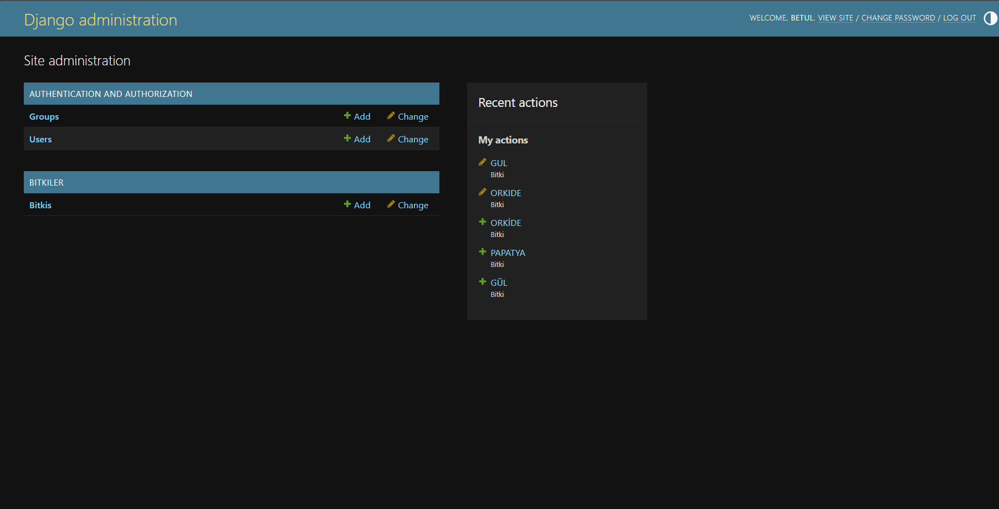
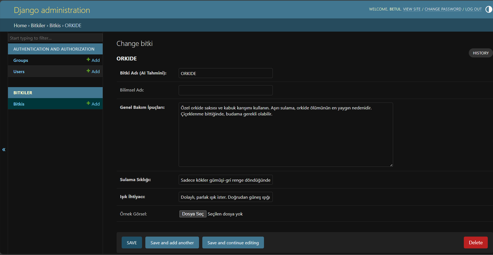
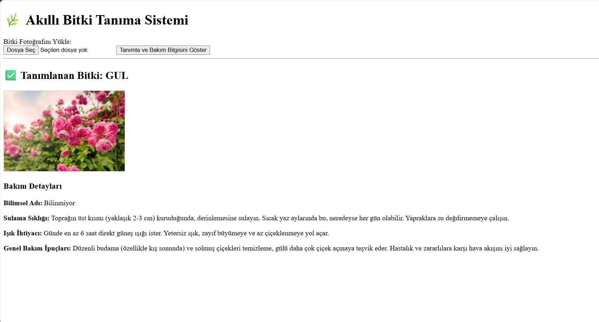

# akilli_bitki_tanima_projesi
# Proje-5
# PYTHON

-----------------------------------------------

# Proje Açıklaması
--------------------

Bu proje, TensorFlow/Keras ile eğitilmiş bir Derin Öğrenme (CNN) modelini kullanarak yüklenen görüntüdeki bitki türünü otomatik olarak tanımlayan Django tabanlı bir web uygulamasıdır. Kullanıcılar, tanımlama sonucunda bitkinin adını ve buna özel bakım talimatlarını görüntüleyebilirler. Projenin temel zorluğu, az veriyle bile modelin sınıflar arasında doğru ayrım yapabilmesini sağlamaktır.

# VİDEO
--------
<a href=>

Projeyi anlatan videoya ulaşmak için tıklayınız.

</a>

# Bitki Ekleme Ekranı
-----------------------

Bu ekran, projenin arka yüzü olup, bitki tanımlama sonucunda kullanıcıya gösterilecek olan Bakım Detayları'nın (Sulama Sıklığı, Işık İhtiyacı vb.) veritabanına girildiği ve yönetildiği alandır.

# Bitki Tanıma Ekranı
-----------------------

Kullanıcıların yerel cihazlarından fotoğraf yükleyerek tanıma işlemini başlattığı ana sayfadır.

# Tanıma Sonuç Sayfası
------------------------

Modelin tahmin ettiği bitki adı (örn. GÜL) ve veritabanından çekilen detaylı bakım talimatları (Sulama, Işık, Genel İpuçları) bu sayfada gösterilir.

